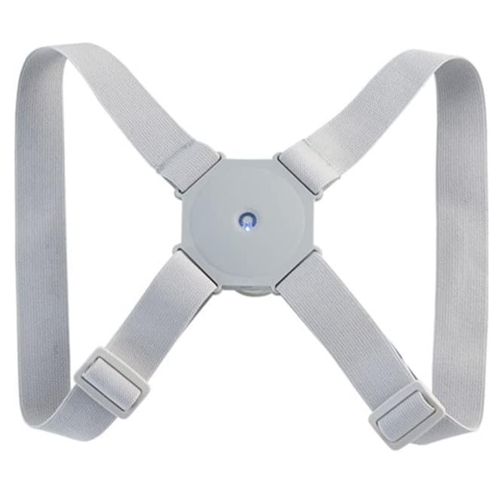



  


  
  
  


  

## Especificaciones del producto
- Material: Poliester
- Dimensiones del producto : 13 x 13 cm
- Peso: 137g
- Para niños y adultos
- Carga USB
- Batería de litio integrada: 3.7V y 500mAh.
- Abre el hombro y alisa la espalda, levanta la cabeza y el pecho, mejora el hombro inclinado.
- El corector vibrará si la joroba se dobla más de 25°
- Hebilla antideslizante, fácil de ajustar, adecuado para niños y adultos.
- Correa de nailon de alta elasticidad, reduce la presión del hombro.
- Corrige la postura y previene la miopía
- Ajustable a la curva del cuerpo
