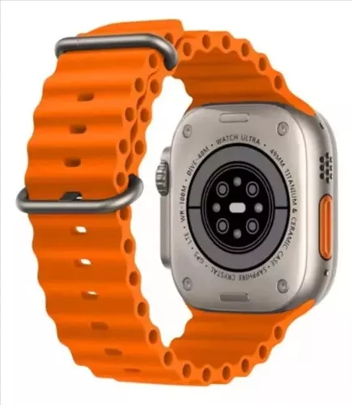



  


  
  
  


  

## Especificaciones del producto
Pantalla táctil de alta definición grande AMOLED, cuenta con Ai watch face, Puede admitir el uso de ChatGPT, 2GB ROM, Dynamic Island, música local, grabación de sonido, calendario, modo de visualización siempre encendido, brújula real, frecuencia cardíaca, presión arterial, oxígeno en sangre, deportes, monitorización del sueño, Presión, Registro de actividad, Llamadas Bluetooth, Notificación de mensajes, Asistente de voz, Control de música, Clima, Despertador, Cronómetro, entrenamiento de respiración, temporizador, encontrar Teléfono, Alipay, frecuencia respiratoria, control de video corto, control de cámara, configuración de notificación, modo al lado del reloj, activación activa de muñeca, modo no molestar, tiempo de apagado de la pantalla, acceso a la puerta NFC, pantalla fuera de la esfera del reloj, ajuste de brillo...
Parámetros
-Tamaño de la pantalla: pantalla AMOLED de 2,02 pulgadas
-Resolución de pantalla: 485520DPI Pantalla AMOLED
-Tamaño del reloj: 4944*14,4mm
-Bluetooth: Bluetooth 5,2 de baja potencia
-Chip incorporado: El más nuevo SF32LB525
-CPU: Arquitectura de doble núcleo 1,4 MB de memoria de ejecución + 2GB de memoria de almacenamiento
-Nuevo Siche SF32LB525: procesador de doble núcleo de alto rendimiento, motor gráfico 2D integrado de alto rendimiento y Acelerador de redes neuronales de Inteligencia Artificial
-Tasa de cepillado de la pantalla: Pantalla de cepillo alta de 240MHz + 48MHz
-Frecuencia dominante de operación: 240 + 48MHz, hace que el rendimiento máximo sea más vigoroso y duradero, y permite la rápida experiencia de la nueva evolución
-Nivel impermeable: vida impermeable
-Tipo de carga: carga inalámbrica magnética
-Capacidad de la batería: 450mAh
-Estilo de menús: 4 tipos de estilo de menús
-Soporte: Android 5,0 y superior y iOS 10,0 y superior
-Aplicación: Wearfit Pro 

